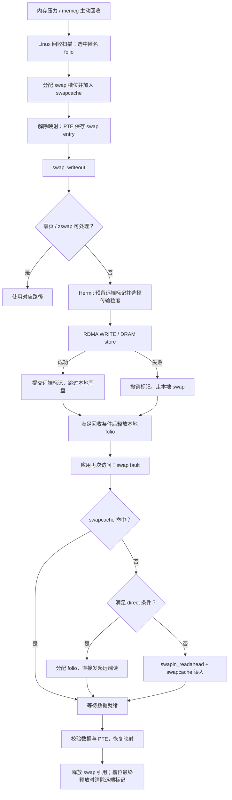

# PEBS 页面大小策略：内核修改与 QEMU 测试总结

> 历史记录（2026-09-09）；2026-09-24 的修复见文末，正文中的旧行为描述不代表当前实现。
> 撰写时间：2026-09-09。对应分支 `hermit-6.18`（`linux-stable`，基于
> 6.18.38）。QEMU 回归尚在后台运行，本文档记录截至撰写时刻的确定结果，
> 未完成项在 §5 单独标注。

## 1. 目标回顾

用 Intel PEBS 硬件采样在线测量 memcg 内 2 MiB 虚拟区域（region）的访问
密度与空间局部性，通过代价模型在 Hermit swap 路径自动选择每次 RDMA
传输的 folio 粒度（order 0 / 2–9），替代全局静态的 `remote_order_mask`；
兼顾 swap-in 的 mTHP 聚合粒度（读放大上限）。完整设计见
`docs/pebs/pebs-order-policy.md`。

## 2. 内核链路

按当前工作区代码，完整链路是：

Linux 负责选页、分配 swap 槽位和维护页表；Hermit 接管实际交换 I/O；RDMA 后端把数据写入远端内存，再在缺页时读回。 PEBS 在其中参与粒度选择。



**1. swapout**

有两类入口，最终进入 Linux 原生回收机制：

- **常规回收**：全局内存压力触发 kswapd、直接回收，或 memcg 达到限制。
- **Hermit 主动回收**：开启 `apt_reclaim` 后，在 memcg 剩余空间小于 `reclaim_headroom_pages` 时提前排队执行 work，调用 `try_to_free_mem_cgroup_pages()`。`reclaim_mode=1` 时可使用多个 worker。

因此，当前 **PEBS 不直接决定淘汰哪些页**；选页仍由 Linux 回收扫描负责。入口见 [memcontrol.c](../../linux-stable/mm/memcontrol.c:1335)。

**2. 选中 folio 后，先建立 swap 身份**

回收路径对匿名 folio 执行：

```text
folio_alloc_swap()
  → 分配 swap entry：type + offset
  → 将 folio 加入 swapcache
try_to_unmap()
  → 移除 present 映射
  → 在 PTE 中记录 swap entry
pageout()
  → swap_writeout()
```

大 folio 需要对应数量的连续槽位；分配失败时，代码尝试拆成小页再分配。

此时 **页表已表示“在 swap 中”，数据仍可能驻留本地 swapcache**。写入完成与真正释放物理内存是后续步骤。

**3. swap-out 如何进入 Hermit**

[swap_writeout()](../../linux-stable/mm/page_io.c:250) 的处理顺序是：

```text
能否直接释放不再需要的 swap？
  → 清除本轮槽位的旧 Hermit 标记
  → 全零 folio：记录 zeromap，免 I/O
  → 尝试 zswap
  → __swap_writepage()
      → 优先 hermit_swap_write_folio()
      → 未处理则走本地 swap
```

所以开启 zswap 时，它可能在 Hermit 之前截获数据。

Hermit 写入内部是：

```text
prepare_remote()       为整个 folio 的各槽位预留 XArray 空间
选择 transfer_order    静态 mask / PEBS / force_order
backend_store()        等待整个 folio 传输完成
commit_remote()        为每个槽位提交远端标记
完成 writeback         返回，不提交本地 swap BIO
```

远端标记记录原始 extent 的 order。后续读取会用它判断某个范围是否仍完整地位于远端。

**当前 store 是同步等待完成的**；异步回收 worker 并不意味着 store 调用本身异步返回。

**4. RDMA 实际如何传输**

客户端先与服务器建立连接，取得服务器注册内存的地址和 `rkey`。数据路径中，客户端根据 swap offset 定位远端 chunk：

```text
swap offset
  → 远端内存中的字节偏移
  → chunk + chunk 内偏移
  → 映射本地 folio 的 DMA 地址
  → 构造 RDMA WRITE / READ
  → ib_post_send()
  → poll CQ，处理完成与错误
```

这是单边 RDMA；每次页读写无需服务器应用线程接收请求再复制数据。

目前 [rswap_submit_folio()](../../remoteswap/client/rswap_rdma_ops.c:335) 只有两种实际传输形式：

| 条件 | 实际 WR |
|---|---|
| `transfer_order == folio_order`，且为大 folio | 整个 folio 一个 WR |
| 其他情况 | 每个 4 KiB 页一个 WR |

大请求失败时，会等待已提交请求结束，再尝试 4 KiB 路径；最终 store 仍失败，内核撤销远端标记并写本地 swap。

因此，**对 2 MiB folio 选择 64 KiB，目前不会得到 32 个 64 KiB WR，而会走 512 个 4 KiB WR**。

**5. 应用再次访问时，如何 swap-in**

CPU 遇到非 present 的 swap PTE，进入 `do_swap_page()`，先查 swapcache。

- **命中**：复用已有 folio，必要时等待读取完成，无需再发远端读。
- **未命中**：选择 direct 或普通 swapcache 路径。

Hermit direct 的主要条件是：

```text
bypass_swapcache 开启
&& backend 就绪
&& entry 有远端标记
&& swap 引用计数为 1
```

当前代码的 Hermit direct **已不要求本地设备设置 `SWP_SYNCHRONOUS_IO`**，这点 README 尚未同步。

direct 路径在 [memory.c](../../linux-stable/mm/memory.c:4785) 中执行：

```text
alloc_swap_folio()       选择并分配读回 folio
swapcache_prepare()     占用协调标志，防止并发 fault 与槽位复用
设置 folio->swap
发起 Hermit load
处理 memcg / workingset / LRU 元数据
等待 load 完成
```

这里虽然使用 `swapcache_prepare()` 协调并发，**folio 本身并未插入 swapcache**。

`speculative_io` 决定读请求与元数据处理的顺序：

- 关闭：同步读完，再处理后续元数据。
- 开启：先提交异步读，再处理元数据，最后 poll，重叠两部分时间。
- `lazy_poll` 开启：对该请求反复非阻塞 poll；超过代码中的 100 ms 门限后转入等待式 poll。它不是超时失败，也不是让应用在数据未到时继续访问。

普通路径则通过 `swapin_readahead()` 建立 swapcache folio，再由 `swap_read_folio()` 按 **zeromap → zswap → Hermit → 本地设备** 的顺序读取。普通 Hermit load 使用同步 backend 调用。

**6. PEBS 在哪两个位置生效**

| 位置 | 当前作用 |
|---|---|
| swap-out，构造 `hermit_io` 时 | 根据区域访问位图选择 `transfer_order` |
| direct swap-in 的 `alloc_swap_folio()` | 限制候选 folio order，控制一次 fault 读回的数据量 |

需要区分三种大小：

- **原始 folio 大小**：Linux 分配和回收的内存单位。
- **swap-in folio 大小**：此次缺页实际分配、读回的单位，可以小于原始 extent。
- **WR 大小**：backend 实际发出的 RDMA 请求长度。

当前读取函数仍根据读回 folio 大小和静态有效 mask 设置 `transfer_order`，没有再次直接调用 PEBS；PEBS 主要通过限制分配大小影响 direct swap-in。

order-9 远端 extent 在满足配置、对齐和连续 PTE 等条件时，可读回 2 MiB 连续 folio，随后安装多个 PTE，**不是直接建立 PMD 映射**。

**7. 读完之后，如何结束这一轮交换**

读取成功后，Hermit 将 folio 标记为 `uptodate` 并解锁。缺页路径随后：

```text
重新锁定并检查 folio
  → 检查原 swap PTE 是否被其他线程修改
  → 检查数据是否 uptodate
  → 建立匿名页反向映射并恢复 present PTE
  → 减少 swap 引用
  → 应用重试访存指令
```

槽位未必在读回瞬间释放；它还可能被其他 PTE 或 swapcache 引用。最终释放时，[swap_range_free()](../../linux-stable/mm/swapfile.c:1261) 逐槽清除 Hermit 标记。远端内存无需逐页发送释放 RPC，原位置可在槽位复用时覆盖。

最后更正上一条分析中的一个边界：**已发起的远端读取失败会留下非 uptodate folio，缺页路径可返回 SIGBUS；但当前普通读取代码在 backend 消失时会落到本地读取。** 对 remote-only entry，本地副本可能无效，因此这条异常分支仍有正确性风险，也说明必须先成功 `swapoff` 再卸载 backend。

## 2026-09-24 修复更新

- 回收在 unmap 前计算策略，持 anon_vma 读锁；使用栈参数传到写出函数。
- RDMA 支持中间粒度分段，2 MiB / 64 KiB 对应 32 个 WR。
- `wr_stats` 记录真实 WR 粒度与字节；DRAM 大 folio 如实记录 base-page fallback。
- remote-only entry 的 backend 消失时读取失败，不再回落无效本地数据。
- 修复 perf ring 页索引、跨页/回绕读取、非覆盖模式、引用计数初始化与重复释放。
- region 保持 mm 身份引用；淘汰/销毁释放引用，过期样本回退未知。
- QEMU stats helper 参数由 int 改为 long，与 syscall 472 一致，消除 8 字节写入
  4 字节栈变量导致的 stack smashing。
- 策略测试复用生产决策函数，新增 ring 与 perf 生命周期测试。

硬件 PEBS 与 RDMA 端到端性能仍需实机验证。
